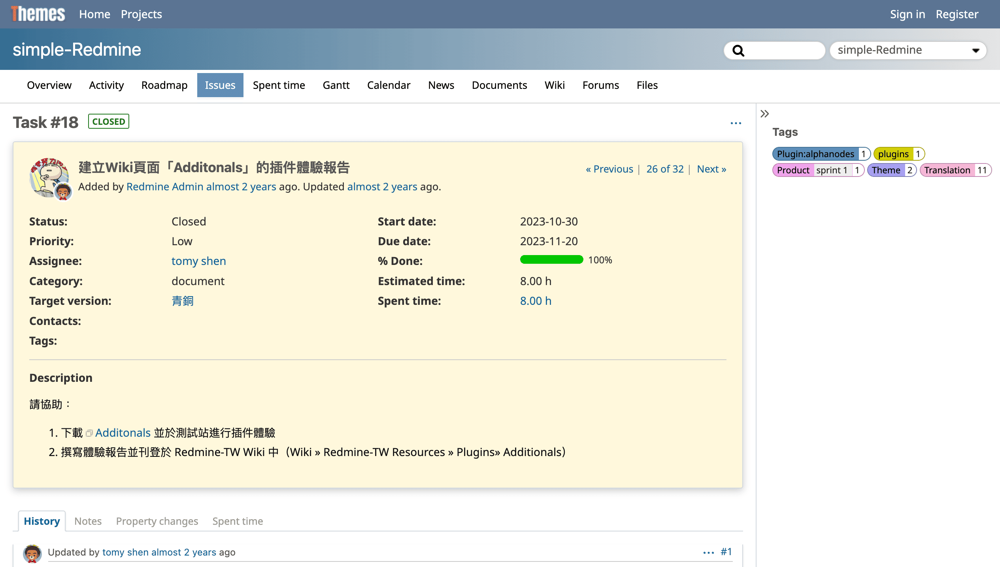
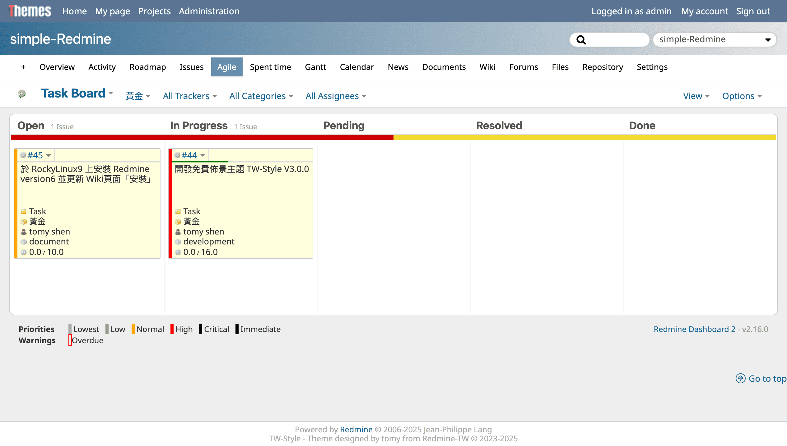

# TW-Style

A free Redmine theme made in Taiwan.

With simple design, create a style that is compatible with English and Chinese visuals. This is my first time working on Github. If you like this, please feel free to give a star to this project.

**Version：** 2.0.1

**Compatible with :** Redmine 5.1 - 4.1

**Supported by :** [Redmine-TW](https://redmine-tw.net)

## Installation

To install TW-Style, just download .zip and unpack it to your Redmine's public/themes folder.
Then go to Redmine > Administration > Settings > Display and select TW-Style from the list and save the changes.

## How to replace Logo for your Redmine

1. Find 'Website LOGO' in the application.css
2. Change the file name if you upload new image
3. If your image file size is too large or too small, You may also need to adjust css parameters

## Screenshots

## Contributing

1. Fork it
2. Create your feature branch (git checkout -b my-new-feature)
3. Commit your changes (git commit -am 'Add some feature')
4. Push to the branch (git push origin my-new-feature)
5. Create new Pull Request

## License

+ MIT

See License file to read detail.
